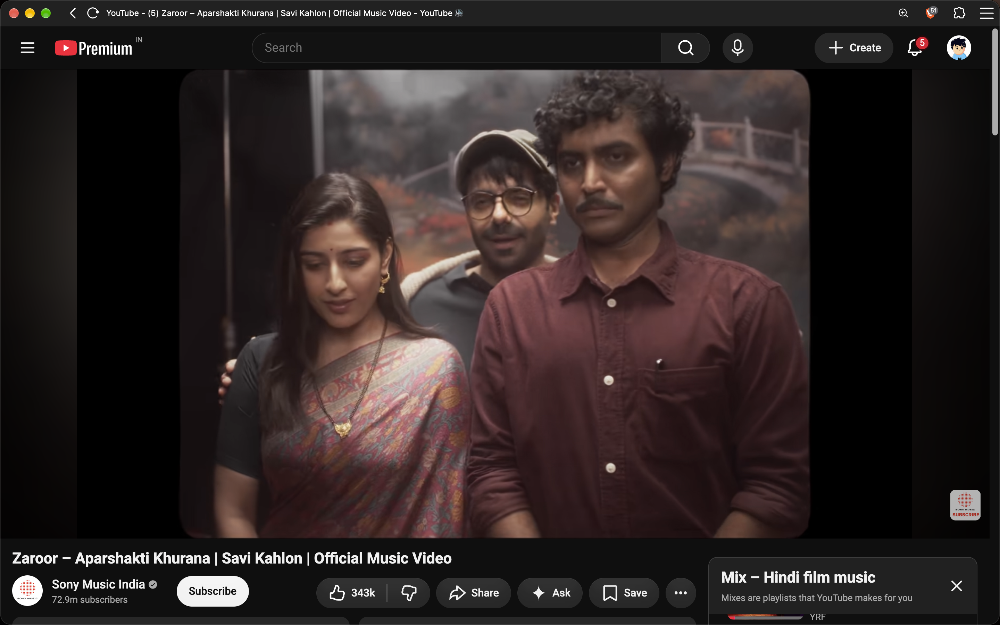
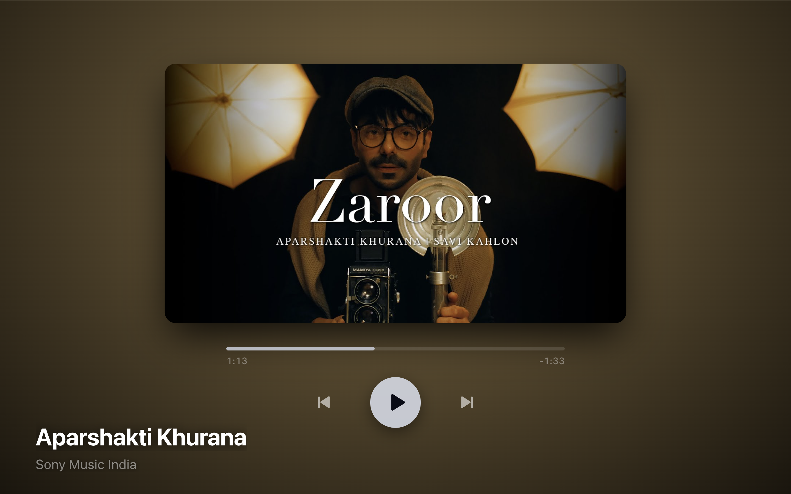

# YouTune 🎵
> **YouTube, but made for music.**

Transform YouTube into a beautiful, music-focused fullscreen player with luminous atmospheric lighting, enlarged uncropped artwork, left/right swipe transitions, idle auto-hide, and zero audio hijacking.

---

## Feature

### From YouTube to YouTune

If we're listening to something passively, why settle for a cluttered interface?

YouTune transforms the ordinary YouTube experience into a beautiful, immersive music player — letting the music take center stage instead of the UI.

<div align="center">

<table>
<tr>
<td align="center">

</td>

<td align="center" style="font-size: 40px; padding: 0 20px;">
→
</td>

<td align="center">

</td>
</tr>
</table>
</div>

<br>

> **YouTube is built around watching. YouTune is built around listening.**

### Luminous Dynamic Background

The background dynamically adapts to the vibrant colors of the track's album artwork, creating an atmospheric glow that changes with every song — without becoming overly dark or murky.

### Immersive Artwork

Album artwork is enlarged and presented without unnecessary cropping, turning your screen into a dedicated music experience.

### Natural Track Transitions

Swipe left or right to move between tracks with smooth visual transitions, making navigation feel more like a dedicated music player.

### Distraction-Free Interface

Controls automatically hide when idle, allowing you to simply enjoy the music without a screen full of buttons and recommendations.

### Zero Audio Hijacking

YouTune enhances the visual experience without taking control of YouTube's audio playback.

---

## Keyboard Shortcuts

When YouTune mode is active:

| Key | Action |
|---|---|
| `Alt + Shift + Y` / `⌥ + ⇧ + Y` | Toggle YouTune Mode (Global) |
| `Space` | Play / Pause |
| `Arrow Up` | Volume Up (+5%) |
| `Arrow Down` | Volume Down (-5%) |
| `Arrow Left` | Seek backward 5 seconds |
| `Arrow Right` | Seek forward 5 seconds |
| `Shift + Arrow Left` or `Ctrl/Cmd + Arrow Left` | Previous track (with right swipe animation) |
| `Shift + Arrow Right` or `Ctrl/Cmd + Arrow Right` | Next track (with left swipe animation) |
| `M` | Toggle Mute |
| `F` | Toggle Browser Fullscreen |
| `Esc` | Exit Browser Fullscreen / Exit YouTune Mode |

---

## How to Reload in Chrome / brave

1. Open `chrome://extensions` or `brave://extensions` in your browser.
2. Enable ```Developer mode```
3. Click ```Load upacked```
4. Select **YouTune** (if the repo is downloaded locally)

